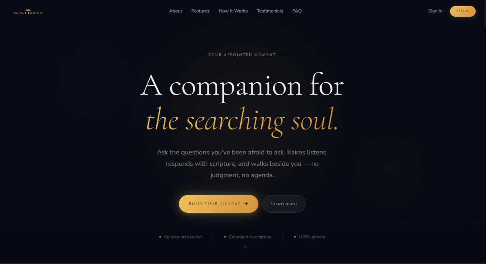
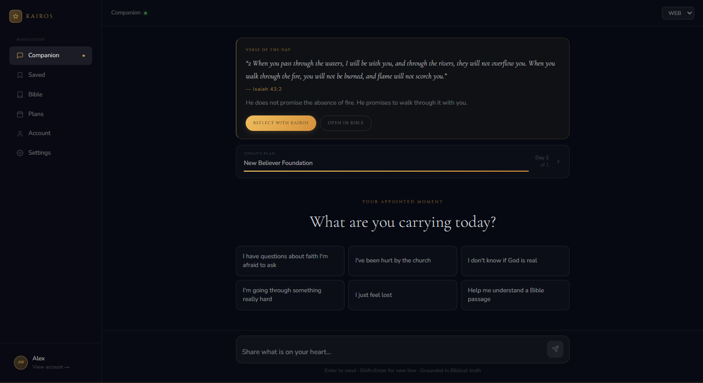
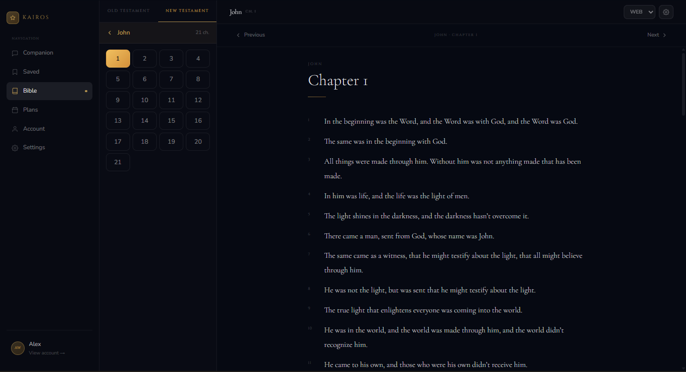
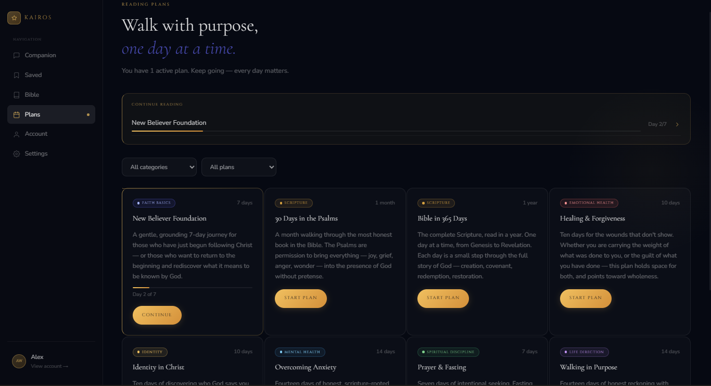
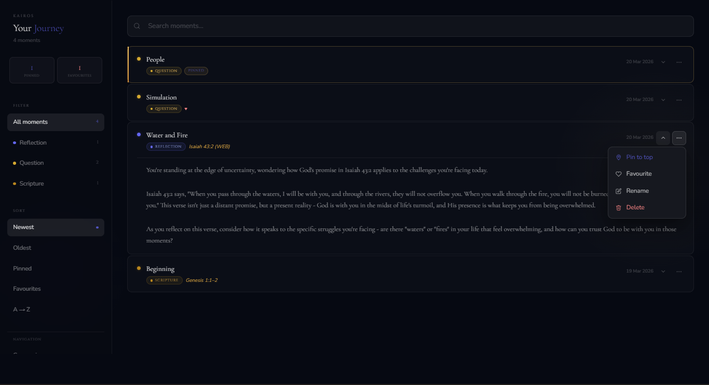
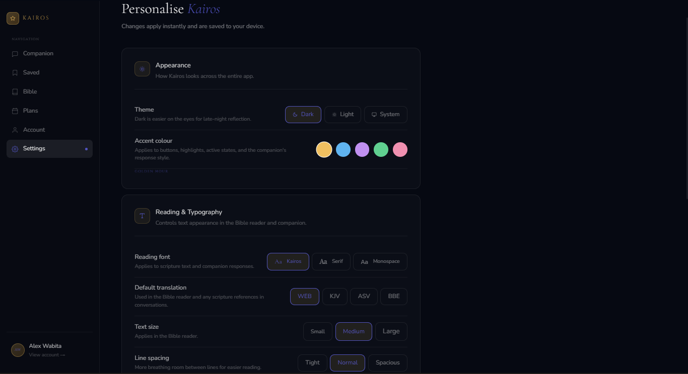

<p align="center">
  
</p>

<h1 align="center">Kairos</h1>
<p align="center"><em>A Biblical AI Life Companion</em></p>

<p align="center">
  <a href="https://kairos-ebon.vercel.app"></a>
  
  
  
  
  
  
</p>

<p align="center">
  <a href="https://kairos-ebon.vercel.app">Live App</a> ·
  <a href="#architecture">Architecture</a> ·
  <a href="#features">Features</a> ·
  <a href="#tech-stack">Tech Stack</a> ·
  <a href="docs/CHALLENGES.md">Engineering Challenges</a> ·
  <a href="CHANGELOG.md">Changelog</a>
</p>

---

## Who Kairos Is For

Kairos is for anyone who has ever had a question they felt they couldn't ask in church. Anyone carrying grief, doubt, or curiosity about faith and looking for a space to engage it honestly. Anyone who reads a verse and wants to go deeper than a surface explanation.

It is **not** a replacement for scripture, pastoral care, or community. It is a companion — something that listens to where you actually are, engages your real questions, and grounds every response in the Bible.

**In one sentence:** Kairos is a Biblical AI that meets you exactly where you are — no judgment, no agenda, no shortcuts.

> **Try it now:** [kairos-ebon.vercel.app](https://kairos-ebon.vercel.app) — no account required to start a conversation.

---

## Start Here — 3 Things to Try in Your First 5 Minutes

You do not need an account to begin. Open the app and try one of these:

**1. Ask a hard question**
Go to the Companion and ask something you have genuinely wondered about — suffering, doubt, a difficult passage, a personal struggle. See how Kairos responds differently from a generic AI.

**2. Open a scripture and go deeper**
Go to the Bible reader, open any chapter, select a verse, and tap "Ask Kairos about this." The companion receives the full verse context and responds as if you are studying together.

**3. Start a reading plan**
Go to Plans, enroll in any plan, and complete Day 1. Write a personal note at the end. It saves automatically to your Journey — a private spiritual journal that grows with you.

---

## Project Status

| | |
|---|---|
| **Version** | 1.0.0 — Production |
| **State** | Live, actively maintained |
| **Built by** | Alex Wabita (solo) |
| **Launched** | March 2026 |
| **Deployment** | Vercel (auto-deploys on push to `main`) |
| **Next milestone** | Phase 8 — Organisation Portal (in design) |

---

## A Note on Safety and Integrity

Kairos is built for a context where the stakes are real. People bring grief, doubt, crisis, and genuine faith questions. Because of that, several deliberate constraints are built into how it works:

- Kairos never claims spiritual authority it does not have. It is calibrated for humility.
- It is not a therapist, a pastor, or a medical advisor. It says so clearly when relevant.
- Responses are grounded in a curated Biblical theology knowledge base — not the open internet.
- No engagement streaks, gamification, or notifications designed to maximise session time.
- User data is never sold, shared, or used to train AI models.
- All data can be exported or permanently deleted from the Account page at any time.

---

## Screenshots

| Homepage | AI Companion | Bible Reader |
|----------|-------------|--------------|
|  |  |  |
| *Dark void homepage with gold accents* | *Conversational companion with scripture grounding* | *3-panel Bible reader with verse actions* |

| Reading Plans | Journey Saved | Settings |
|---------------|---------------|----------|
|  |  |  |
| *Day-by-day progress with honest catch-up* | *Private spiritual journal with search and filters* | *Theme, accent, font, and companion preferences* |

---

## Features

### 🤖 AI Companion
- Conversational spiritual companion powered by a **3-model Groq fallback chain** (llama-3.3-70b → llama-3.1-70b → mixtral) with OpenRouter and Gemini as secondary and tertiary fallbacks
- **RAG (Retrieval-Augmented Generation)** — responses grounded in a curated Biblical theology knowledge base, not the open internet
- Jina AI embeddings (768-dimension vectors) stored in Supabase pgvector for semantic search
- Guardrail system that preserves tone, humility, and theological integrity
- Context-aware: knows your active reading plan, verse of the day, and past conversations
- Voice input support via Web Speech API

### 📖 Bible Reader
- Full in-app Bible reader with **4 translations**: WEB, KJV, ASV, BBE
- Powered by `bible-api.com` — zero API key required
- 66-book static data structure with book/chapter navigation
- Session-based verse highlighting
- **"Ask Kairos about this"** — seamless handoff from any verse to the companion via `sessionStorage` context passing
- Notes flow directly into the Journey via `SaveMomentModal`
- Mobile-optimised: fixed action bar clears browser chrome and bottom nav via `calc(58px + env(safe-area-inset-bottom))`

### 📅 Reading Plans & Guided Study
- Full reading plan system with enrollment, day-by-day progress, and completion tracking
- **Catch Me Up** — advances `current_day` to the next unread day without falsely marking skipped days as complete (honest progress)
- Verse of the Day: static array of 365 curated verses, cycling by day-of-year — no API dependency
- Personal notes on day completion auto-saved as `journey_entries`
- Devotional text, reflection prompts, and prayer prompts per day

### 🌟 Journey (Saved Moments)
- Persistent spiritual journal — save moments from companion conversations, Bible study, or reading plans
- Real-time search across titles, content, and scripture references
- Filter by entry type (reflection, prayer, insight, verse, note) and sort by date or type
- `SaveMomentModal` with auto-title suggestion and entry-type detection
- Full CRUD with Supabase Row Level Security

### 🔐 Authentication
- Email/password auth via Supabase Auth
- PKCE code exchange + OTP token_hash flows handled in a single `/api/auth/callback` route
- `returnTo` redirect logic — preserves destination across login flow
- `InlineSignInModal` — allows unauthenticated users to sign in mid-flow without losing chat state
- Route protection via Next.js middleware

### 🎨 Design System
- **Leonardo AI aesthetic** — ultra-dark void (`#060912`), floating pill navigation, subtle card borders
- Full light/dark/system theme support via `ThemeApplier.jsx` — injects CSS variable overrides globally
- 5 accent colour palettes: Gold (default), Ocean, Dusk, Forest, Rose
- 3 reading font options: Default (Cormorant Garamond), Serif (Georgia), Mono (JetBrains Mono)
- Design token system (`--space-1` through `--space-24`, `--radius-*`, `--color-*`) — never violated
- 220px sticky sidebar on all app pages; 58px fixed bottom nav on mobile with `env(safe-area-inset-bottom)`
- All interactive elements minimum 44px touch target

### 📬 Contact System
- Resend-powered email system with **6 type-aware auto-replies** (feedback, question, prayer, partnership, bug, other)
- Prayer requests receive a pastoral auto-reply including 1 Peter 5:7
- All messages saved to Supabase `contact_messages` table

---

## Tech Stack

| Layer | Technology | Purpose |
|-------|-----------|---------|
| **Framework** | Next.js 16.1.6 (App Router, Turbopack) | Full-stack React framework |
| **Database** | Supabase (PostgreSQL) | Auth, data, pgvector |
| **Primary AI** | Groq | Fast LLM inference (llama-3.3-70b) |
| **AI Fallback** | OpenRouter | Secondary LLM chain (4 models) |
| **AI Fallback 2** | Google Gemini | Tertiary fallback (3 models) |
| **Embeddings** | Jina AI | RAG vectors (768-dim) |
| **Bible API** | bible-api.com | Free, no-key Bible data |
| **Email** | Resend | Transactional email |
| **Deployment** | Vercel | Hosting + CI/CD |
| **Styling** | CSS Variables + Inline styles | Design token system |
| **Fonts** | Cinzel, Cormorant Garamond, Nunito | Via Google Fonts |

### Why this stack?

**Groq over OpenAI:** Groq's inference speed is 10–20× faster than OpenAI's API at a fraction of the cost, making real-time conversational AI viable on a free/low-cost budget.

**Jina AI over Gemini for embeddings:** Gemini embedding API had regional billing restrictions that blocked access from Kenya. Jina AI is free, globally accessible, and produces high-quality 768-dim vectors compatible with Supabase pgvector.

**bible-api.com over paid Bible APIs:** Covers WEB, KJV, ASV, BBE with no API key, no rate limits for reasonable usage, and zero cost.

**Supabase over PlanetScale/Railway:** Provides auth + database + pgvector in a single free-tier product — no separate vector database needed.

**Vercel over Netlify/Railway:** Next.js App Router is optimised for Vercel. Zero-config deployment, automatic preview deployments, edge middleware support.

---

## Architecture

See [`ARCHITECTURE.md`](ARCHITECTURE.md) for the full technical deep dive.

```
kairos/
├── src/
│   ├── app/                    # Next.js App Router pages + API routes
│   │   ├── (auth)/             # Login, register, forgot-password
│   │   ├── api/                # All API routes (AI, Bible, plans, auth, contact)
│   │   ├── journey/            # Companion + saved moments
│   │   ├── bible/              # Bible reader
│   │   ├── plans/              # Reading plans + day pages
│   │   ├── account/            # User account management
│   │   └── settings/           # Theme, font, translation, companion settings
│   ├── components/
│   │   ├── companion/          # AI companion UI (CompanionCore, SaveMomentModal, etc.)
│   │   ├── landing/            # Homepage sections (Hero, FAQ, Contact, etc.)
│   │   ├── shared/             # Navbar, Footer, ThemeApplier, ConfirmModal
│   │   └── ui/                 # Base components (Button, Card, Input, Modal)
│   ├── context/                # React context (Settings, Companion, Journey, User)
│   ├── hooks/                  # Custom hooks (useAuth, useAuthState, useCompanion, etc.)
│   ├── lib/
│   │   ├── ai/                 # LLM client, context builder, guardrails, prompts
│   │   ├── bible/              # Bible client + 365-day verse array
│   │   ├── rag/                # Jina AI embeddings + pgvector search
│   │   └── supabase/           # Client, server, auth, middleware helpers
│   └── styles/                 # tokens.css, animations.css, typography.css
├── supabase/
│   └── migrations/             # 4 SQL migration files
└── docs/                       # PROJECT.md, ARCHITECTURE.md, CHALLENGES.md
```

### Key architectural decisions

**Profile ID vs Auth UUID:** All database queries use `users.id` (internal profile ID), never the Supabase auth UUID directly. Separates identity from authentication — auth provider changes are non-breaking.

**AI fallback chain:** The companion never fails silently. Groq → OpenRouter (4 models) → Gemini (3 models). Users never see an AI error on the first attempt.

**RAG over fine-tuning:** RAG allows the knowledge base to be updated without retraining — new theological content can be added by inserting new embeddings into Supabase.

**sessionStorage for Bible→Companion handoff:** Verse context written to `sessionStorage` and consumed by `CompanionCore` on mount. Avoids URL-based state and query params.

---

## How Kairos Stays Free

| Service | Free Tier | Kairos Usage |
|---------|-----------|--------------|
| Vercel | Unlimited hobby deployments | Full app hosting |
| Supabase | 500MB DB, 2GB bandwidth, 50MB vectors | Well within limits at launch |
| Groq | ~14,400 requests/day on free tier | Sufficient for early user base |
| Jina AI | 1M tokens/month free | RAG embedding generation |
| bible-api.com | Unlimited, no key | Bible chapter fetches |
| Resend | 3,000 emails/month | Contact form only |
| Google Fonts | Free | Cinzel, Cormorant Garamond, Nunito |

**The honest answer:** The free tier stack is viable for hundreds of daily active users. At scale, a monetisation layer (optional premium features) would be introduced — without removing core companion functionality from free users.

---

## Development Journey

Kairos was built across **8 disciplined phases** over several months, each with a defined scope and a git commit at completion.

| Phase | Focus | Key Deliverable |
|-------|-------|----------------|
| 1–3 | Foundation | Project scaffold, Supabase schema, basic routing |
| 4–5 | AI Core | Groq integration, RAG system, companion logic |
| 6 | Auth + Bible | Email auth, PKCE flow, Bible API integration |
| 7A–7F | App Pages | Account, Settings, Plans, Journey pages |
| 7G | Journey Saved | Real-time search, filters, SaveMomentModal |
| 7H | Bible Reader | 3-panel layout, verse actions, session highlights |
| 7I | Reading Plans | Day pages, VotD, Guided Study, daily experience surface |
| 7J | Full Redesign + Launch | Leonardo AI aesthetic, homepage rebuild, Vercel deployment |

See [`CHANGELOG.md`](CHANGELOG.md) for the complete version history and [`docs/CHALLENGES.md`](docs/CHALLENGES.md) for engineering problems and solutions at each phase.

---

## Getting Started

### Prerequisites
- Node.js 18+
- A Supabase project
- A Groq API key (free at [console.groq.com](https://console.groq.com))
- A Jina AI API key (free at [jina.ai](https://jina.ai))

### Installation

```bash
git clone https://github.com/AlexWabita/kairos.git
cd kairos
npm install --legacy-peer-deps
```

### Environment Variables

Copy `.env.example` to `.env.local` and fill in your values:

```bash
cp .env.example .env.local
```

Minimum required keys to run locally:
```env
NEXT_PUBLIC_SUPABASE_URL=your_supabase_url
NEXT_PUBLIC_SUPABASE_ANON_KEY=your_supabase_anon_key
SUPABASE_SERVICE_ROLE_KEY=your_service_role_key
GROQ_API_KEY=your_groq_key
JINA_API_KEY=your_jina_key
```

Full key list in `.env.example`.

### Database Setup

Run the migrations in order in your Supabase SQL editor:

```
supabase/migrations/001_initial_schema.sql
supabase/migrations/002_user_profiles.sql
supabase/migrations/003_journeys.sql
supabase/migrations/004_reading_plans.sql
```

Then seed reading plans:
```
GET /api/admin/seed?secret=YOUR_SEED_SECRET
```

### Run

```bash
npm run dev
```

Open [http://localhost:3000](http://localhost:3000).

---

## Deployment

Any push to `main` triggers a production deployment on Vercel.

```bash
git add .
git commit -m "your message"
git push origin main
```

Add all keys from `.env.example` in Vercel → Project Settings → Environment Variables.

---

## Engineering Challenges

**Authentication loop** — `createClient` vs `createBrowserClient` caused an infinite redirect loop. Solved by migrating to `createBrowserClient`, a reactive `useAuthState` hook, and `returnTo` middleware logic.

**Bible action bar on mobile** — Fixed bar obscured by browser chrome on iOS Safari and Android. Solved with `bottom: calc(58px + env(safe-area-inset-bottom))`.

**Profile ID vs Auth UUID** — Bible saves silently failed because the auth UUID was passed where the profile ID was expected. Established a strict server-side resolution pattern across all API routes.

**RAG provider switch mid-development** — Gemini embedding API blocked by regional billing restrictions from Kenya. Migrated to Jina AI — same vector dimensions, zero schema change.

**Light theme invisible text** — Hardcoded `rgba(255,255,255,x)` inline styles were immune to CSS variable overrides. Moved colors to CSS class names with `[data-theme="light"]` overrides.

Full catalogue with root cause analysis: [`docs/CHALLENGES.md`](docs/CHALLENGES.md)

---

## Design Philosophy

> *"Kairos is a companion, not a tool."*

Every design decision was evaluated against one question: **does this serve someone who is searching, grieving, doubting, or growing — or does it serve metrics?**

This shaped concrete decisions:
- No engagement notifications, streaks, or gamification
- No "chat history" framing — conversations are *moments*, saved to a *Journey*
- AI responses calibrated for humility — Kairos never claims authority it doesn't have
- Design language (dark void, sacred gold, serifed typography) reflects reverence, not productivity
- Light/dark themes exist for accessibility; the dark default exists because the product feels different at night

---

## Roadmap

- [ ] **Phase 8 — Organisation Portal:** church/ministry group accounts, group plan progress, org-admin auth separation
- [ ] Custom domain + professional email (`hello@kairos.app`)
- [ ] Push notifications (VotD, reading reminders) via Web Push API
- [ ] Community prayer board (shared, moderated)
- [ ] Expanded RAG knowledge base (patristic writings, systematic theology)
- [ ] Native mobile app (React Native / Expo)
- [ ] Architecture diagram in docs

---

## Contributing

See [`CONTRIBUTING.md`](CONTRIBUTING.md) for guidelines.

Solo project with strong design and architectural opinions. Contributions welcome but should align with the companion-first philosophy and existing design system. Open an issue before starting significant work.

---

## License

MIT — see [`LICENSE`](LICENSE).

---

## Author

**Alex Wabita**
Nairobi, Kenya

Built with discipline, care, and a genuine belief that technology can serve the searching soul.

---

<p align="center">
  <em>"For everything there is a season, and a time for every matter under heaven."</em><br/>
  — Ecclesiastes 3:1
</p>